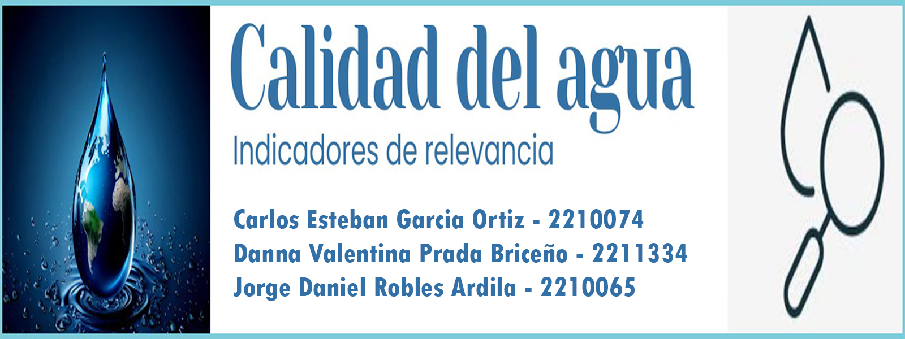

# Proyecto de Potabilidad del Agua

## Integrantes

Carlos Esteban Garcia Ortiz,
Danna Valentina Prada Briceño,
Jorge Daniel Robles Ardila.

## Objetivo

Este proyecto está enfocado en el análisis de la potabilidad de muestras de agua utilizando técnicas de inteligencia artificial.

## Dataset

## Modelos

## Codigo

## Video

